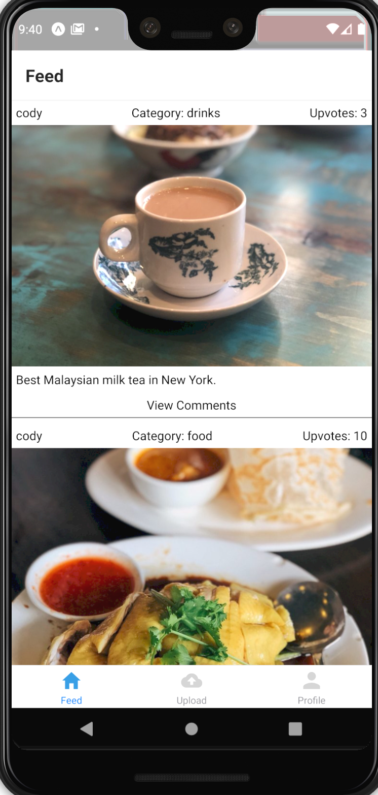
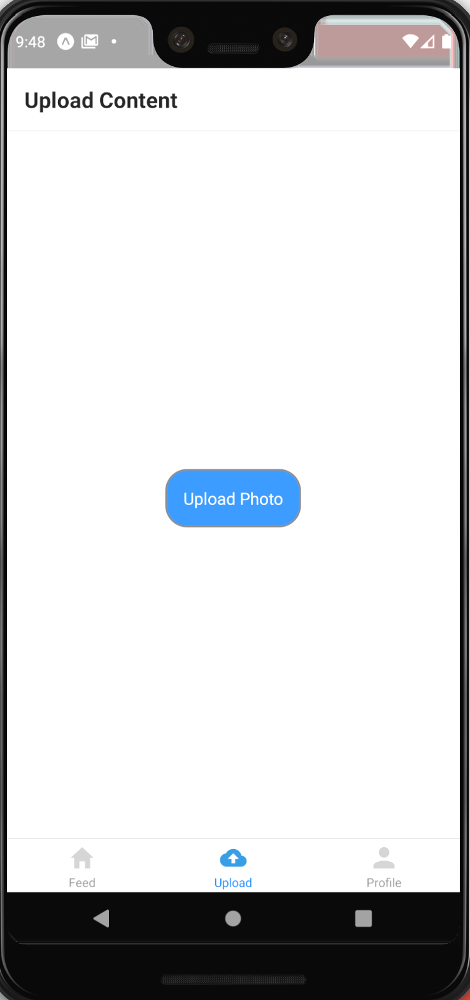
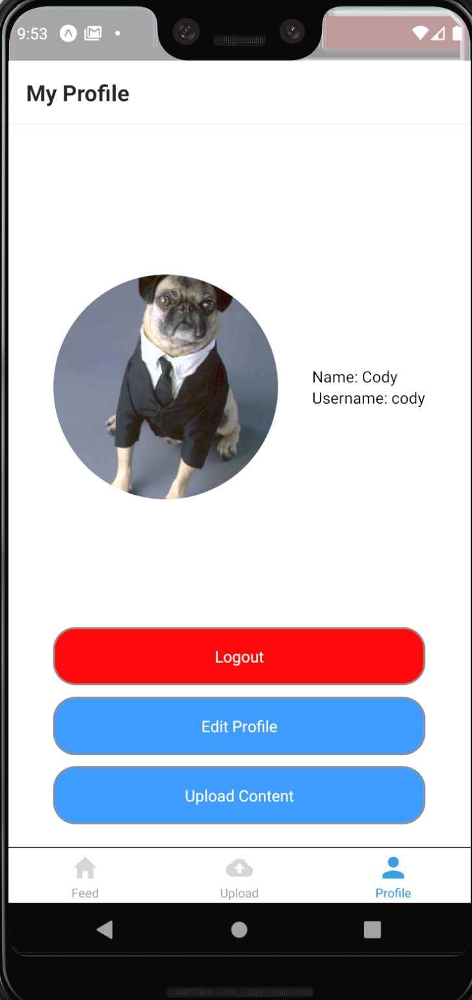

# Dip

Currently work in progress.

Dip is a social media mobile app that allows users to discover the best food and drinks in the area. Sometimes we find ourselves wanting a particular item but not necessarily the whole menu at restaurants. This is where Dip comes into play, where users can view, create, and upvote/downvote posts that display a single item from a restaurant/bar/cafe/etc. The most popular posts are pushed to the top, so if a user is craving gnocchi, for example, they can see where others think the best gnocchi is. There are 3 interactive tabs: Feed, Upload, and Profile.

Built partial functionality over one weekend using React Native via Expo and Firebase.

## Feed:

## Upload:

## Profile:

